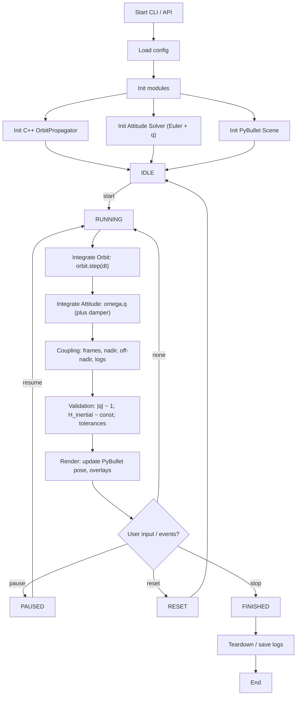

```mermaid
flowchart TD
  A["Start CLI / API"] --> B["Load config"]
  B --> C["Init modules"]
  C --> C1["Init C++ OrbitPropagator"]
  C --> C2["Init Attitude Solver (Euler + q)"]
  C --> C3["Init PyBullet Scene"]
  C1 --> D["IDLE"]
  C2 --> D
  C3 --> D

  D -->|start| E["RUNNING"]
  E --> F["Integrate Orbit: orbit.step(dt)"]
  F --> G["Integrate Attitude: omega,q (plus damper)"]
  G --> H["Coupling: frames, nadir, off-nadir, logs"]
  H --> I["Validation: |q| ~ 1; H_inertial ~ const; tolerances"]
  I --> J["Render: update PyBullet pose, overlays"]
  J --> K{"User input / events?"}

  K -->|pause| P["PAUSED"]
  K -->|reset| R["RESET"]
  K -->|stop| S["FINISHED"]
  K -->|none| E

  P -->|resume| E
  R --> D
  S --> T["Teardown / save logs"]
  T --> U["End"]
```
